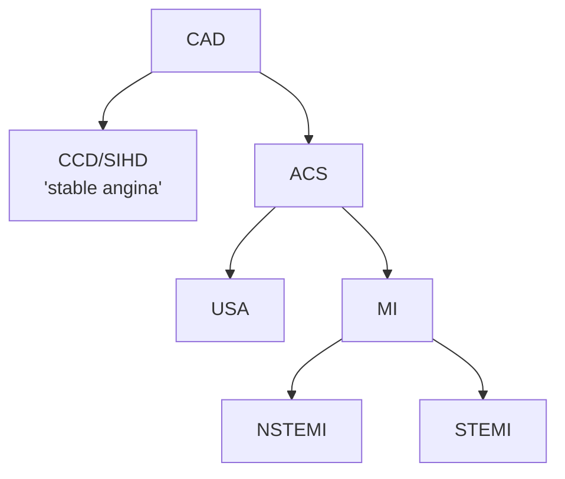

---
tags:
  - CAD
aliases:
  - CAD
---

- Risk Calculation for patients *without* known CAD
	- [[ASCVD Risk Calculator]]
	- [[PREVENT Risk Calculator]]
	- [[MESA Risk Score]]
- [[Cardiac Stress Testing|Stress Testing]]
- Pharmacotherapy
	- [[Aspirin]]
	- [[Hyperlipidemia]]
- Lifestyle Modifications
	- Diet
		- [[Mediterranean Diet]]
		- [[DASH Diet]]

- The coronary arterial system consists of **epicardial coronary arteries**, **prearterioles**, and **arterioles** with different sizes, distinct functions, and uninterrupted borders. [^asia]
	- Myocardial ischemia from the mismatch of demand and supply of coronary artery blood flow to the myocardium can originate from any part of this coronary arterial system
	- ![[Coronary Artery Disease (CAD)-20240817145756329.webp]]

![[Coronary Artery Disease (CAD)-1754697844847.webp]]
Figure source: [^1] - In addition to the ‘classic mechanisms’ (i.e. atherosclerotic disease and vasospastic disease) that lead to myocardial ischaemia, coronary microvascular dysfunction (CMD) has recently emerged as a ‘third’ potential mechanism of myocardial ischaemia. As in the case of the other two mechanisms, coronary microvascular dysfunction (alone or in combination with the other two) can lead to transient myocardial ischaemia as in patients with coronary artery disease (CAD) or cardiomyopathy (CMP) or to severe acute ischaemia as observed in Takotsubo syndrome. CFR, coronary flow reserve.
# Primary Prevention

- Healthful lifestyle & diet
	- [[Mediterranean Diet]]
- <u>No</u> Routine [[Aspirin]] in Primary Prevention if >70 y or if bleeding risk
- Goal LDL: (See [[Hyperlipidemia#Approach to Hyperlipidemia|Approach to Hyperlipidemia]])
	- Known [[ASCVD Risk Calculator|ASCVD]] <55
	- Primary Prevention < 100
- Three Q's/Four Groups (See mermaid diagram in [[Hyperlipidemia#Approach to Hyperlipidemia|Approach to Hyperlipidemia]])
	- [[ASCVD Risk Calculator|ASCVD]]
	- LDL≥190 ([[Familial Hyperlipidemia]])
	- [[Diabetes]]
	- Non-[[Diabetes|DM]]
- Assess Risk:
	- [[Hyperlipidemia#Very High Risk ASCVD|High-risk]]
	- [[Diabetes]]
	- [[Hyperlipidemia#'Risk Enhancers'|Risk-enhancers]]
	- [[Coronary Artery Calcium (CAC)]]
- Consider [[Lipoprotein (a)|Lp(a)]] if Fam Hx early ASCVD
- Consider ApoB if TG ≥ 200

[^asia]: Hwang, D., Park, S.-H., & Koo, B.-K. (2023). Ischemia With Nonobstructive Coronary Artery Disease. JACC: Asia, 3(2), 169–184. https://doi.org/10.1016/j.jacasi.2023.01.004

[^1]: Crea F, Camici PG, Bairey Merz CN. Coronary microvascular dysfunction: an update. Eur Heart J. 2014 May;35(17):1101-11. doi: 10.1093/eurheartj/eht513. Epub 2013 Dec 23. PMID: 24366916; PMCID: PMC4006091.
