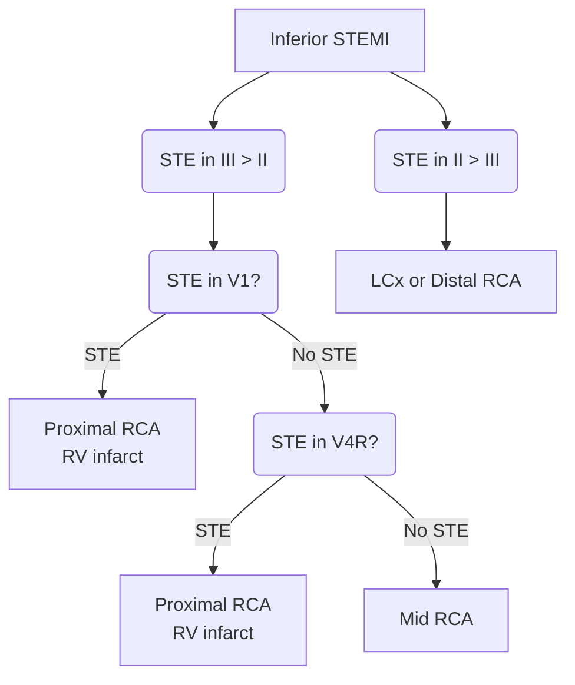

---
tags:
  - CAD
---
- 📝 The inferior territory can be supplied by either the right coronary artery (RCA; 70-90%) or the distal left circumflex artery (LCx, 8-15%).
- You will often see STE in the inferior leads (II, III, aVF) and reciprocal STD in the high lateral leads (I, aVL)
	- If STD in aVL is absent, you should question the diagnosis of Inferior STEMI. However, STD in aVL can rarely be hidden by simultaneous lateral ischemia (in which case you would expect to see STE in V5/V6). [^emcrit]
- [^zbaum] demonstrated a simple heuristic for localization of the culprit artery, i.e. if RCA or LCx involvement, you can compare the STE in leads II, III
	- STE greater in III > II → suggests RCA culprit artery
	- STE greater in II > III → suggests LCx culprit

![[Inferior STEMI-20241220140209197.webp]]
- ⚠️ **A <u>downsloping</u> ST-segment in lead aVL is a red flag that should get your attention!**
	- In the above example, because the ST-segment elevation is < 1 mm the computer is not giving the `***ACUTE MI SUSPECTED***` message. However, the the downsloping ST-segment in lead aVL should make you suspicious. Further, the STD in the precordial leads should also heighten your suspicion for ACS in this case.
- Localizing the lesion in patients with Inferior STEMI [^emcrit]
	- ![[Inferior STEMI-20241220135953481.webp|513]]

# DDx: Strain Pattern

In this example, the reciprocal changes in leads I and aVL are more consistent with a **strain pattern** (secondary ST/T abnormality) resulting from left ventricular hypertrophy.

![[Inferior STEMI-20241220140536989.webp]]

- The [[QRS-T angle]] (difference between the QRS axis and T axis) is 100 degrees! ==Whenever the QRS/T angle is ≥ 100 degrees you should stop and think because there’s an excellent chance it’s not a STEMI!==  
	- Causes include left ventricular hypertrophy, left bundle branch block, and paced rhythm.
	- It’s a sign that you’re probably dealing with a secondary ST/T-wave abnormality as opposed to the primary ST/T-wave changes of cardiac ischemia/injury.
	- ![[Inferior STEMI-20241220140522224.webp|386]]
- STD in aVL: Morphology of Reciprocal Change vs Strain Pattern
	- 

[^ecg-train]: https://www.ecgmedicaltraining.com/importance-of-lead-avl-in-stemi-recognition/
[^emcrit]: https://emcrit.org/ibcc/imi/
[^zbaum]: Zimetbaum PJ, Krishnan S, Gold A, Carrozza JP, Josephson ME. Usefulness of ST-segment elevation in lead III exceeding that of lead II for identifying the location of the totally occluded coronary artery in inferior wall myocardial infarction. American Journal of Cardiology. 1998 Apr 1;81(7):918-9.
