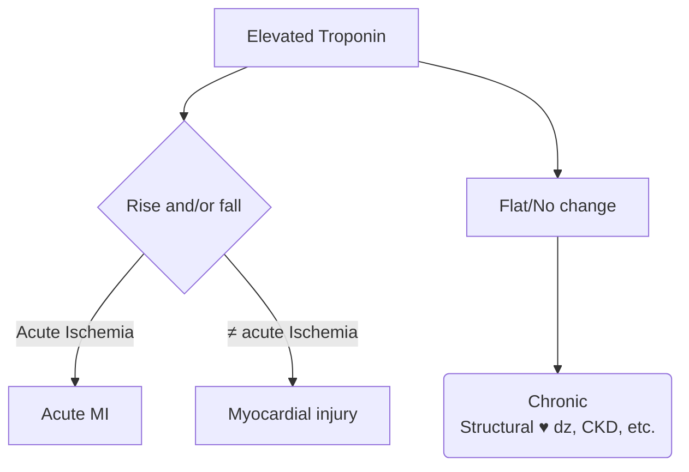

---
tags:
  - CAD
aliases:
  - Elevated Troponin
---

- High-sensitivity cardiac troponin
	- overcomes early "troponin blind" period
	- allows rapid rule-in, rule-out protocols → impacts ED workflow
	- most will be + within 6 hrs
- ‎single sample r/o only if patient's last had CP > 6 hrs ago
- ‎Risk scores
- ⚠️ *late presentation* MI with low hs-cTn may have a small delta for troponin change

# Troponin Elevation

- **Elevated troponin**
	- no CC/MCC
	- non cardiac rise in [[Troponin|troponin]], e.g. rhabdomyolysis, sepsis, etc.
- **Type 2 NSTEMI**
	- MCC
	- Elevated [[Troponin|troponin]] that is probably cardiac-related, but not due to primary plaque rupture, i.e. someone with underlying [[Coronary Artery Disease (CAD)|CAD]] who presents with [[Hypertensive Crisis]], sepsis, [[Heart Failure|HF]] exacerbation, severe anemia, etc.
- **Type 1 NSTEMI**
	- MCC
	- Plaque rupture, needs a stent or has documented severe lesions, or has echo WMA
	- This counts as an MCC and also outcomes are reportable.
	- Activates NSTEMI care pathway for accreditation → echo within 30 days, cardiac rehab, etc.
- **Demand ischemia**
	- CC
	- Not an MI. Use this in a patient with ECG changes or chest pain, but *without* [[Troponin|troponin]] elevation.

- Don't call everything an "NSTEMI":
	- A lot of type 2 NSTEMI patients are really sick from non-cardiac illnesses and if they die or get readmitted then incorrectly makes outcomes look worse.