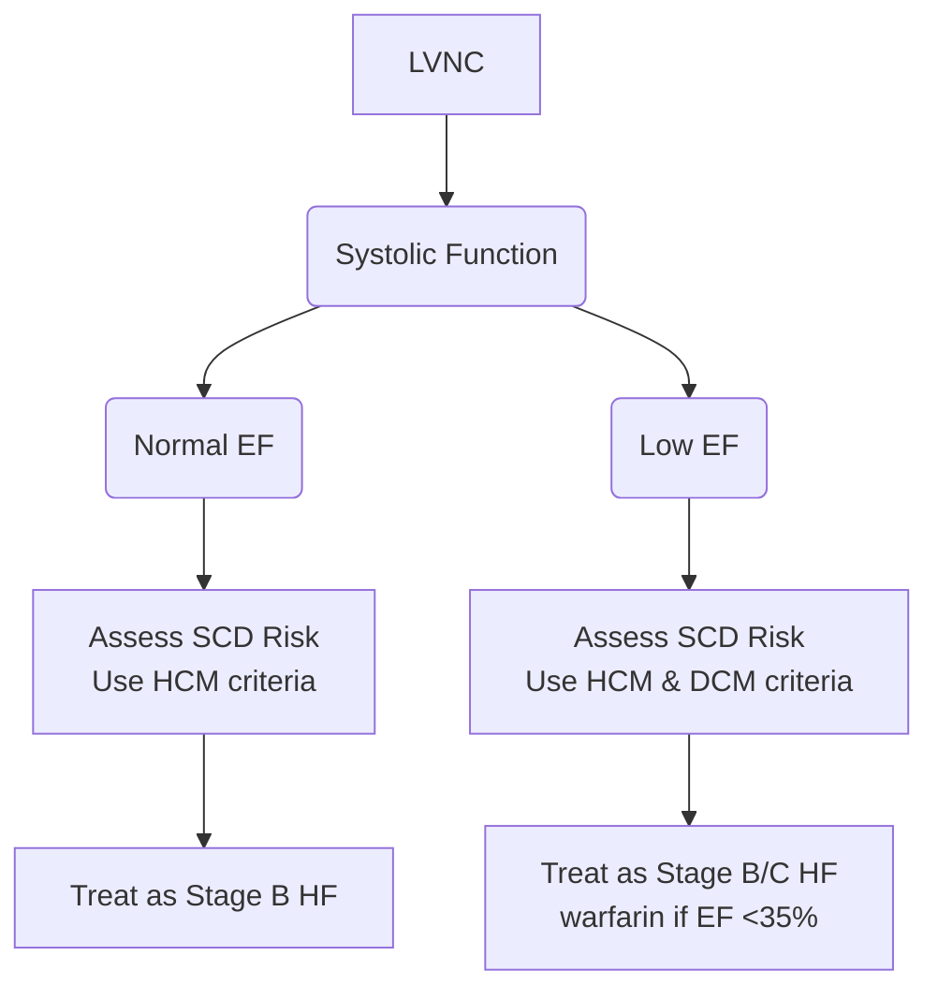

---
tags:
  - cardiomyopathy
aliases:
  - LVNC
---

- LVNC is really a spectrum (compared to what was previously thought)

Ammon's approach to managing patients with LVNC

```mermaid
flowchart TD
    A[LVNC] --> B(Systolic Function)
    B --> C(Normal EF)
    B --> D(Low EF)
    C --> E[Assess SCD Risk<br>Use HCM criteria]
    E --> F[Treat as Stage B HF]
    D --> G[Assess SCD Risk<br>Use HCM & DCM criteria]
    G --> H[Treat as Stage B/C HF<br>warfarin if EF <35%]
  
```