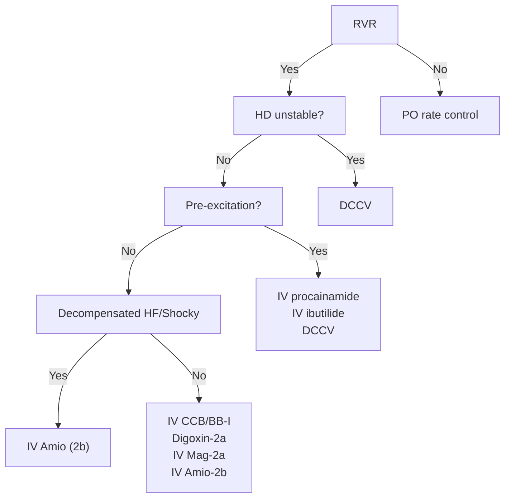

---
tags:
  - EP
aliases:
  - Atrial Fibrillation
  - AFib
---

- 2023 Guideline recommends that patients diagnosed with AF during hospitalization for noncardiac illness (e.g., sepsis) be counseled about their increased risk of recurrent AF
# Classification of AFib

- **Old**: AF is no longer categorized according to valvular or nonvalvular AF. As Tanenbaum would say, this typically refers to "do they have [[Mitral Stenosis|MS]] or not?"
	- This distinction is only currently used to guide OAC strategy.
- 4 stages
	- Stage 1: at-risk for AF
		- Individuals with modifiable and nonmodifiable risk factors, such as obesity or family history of AF
	- Stage 2: Pre-AF
		- Defined as the presence of atrial pathology, including left atrial enlargement, frequent atrial ectopy, or nonsustained atrial tachycardia, but *without* diagnosed AF
		- Includes folks with conditions associated with high incidence of AF, such as atrial flutter, HF, [[Coronary Artery Disease (CAD)|CAD]], valvular heart disease, [[Hypertrophic Cardiomyopathy|HCM]], neuromuscular diseases, and hyperthyroidism
	- Stage 3: AF
		- 3a, paroxysmal AF (recurrent AF episodes lasting ≤ 7 days)
		- 3b, persistent AF (continuous AF episode lasting >7 days)
		- 3c, long-standing persistent AF (continuous AF episode lasting >1 year)
		- 🆕 3d, AF treated successfully with catheter ablation
	- Stage 4: permanent AF
		- decision has been made not to pursue rhythm control based on patient and clinical factors, such as age and AF duration

![[Atrial Fibrillation (AFib)-20250129204255566.webp]]

# Diagnosis

## New-onset AFib

- TTE to assess cardiac structure and to identify possible causes for AF (eg, valve disease), LVEF
- Labs: CBC, BMP, Mg, TSH
- If risk factors present, such as angina, ↓ exercise tolerance, ↓ LVEF, consider ischemic evaluation
- Outpatient evaluation and management is appropriate for patients with asymptomatic or mildly symptomatic AF in the absence of HF, ischemia, or poorly controlled ventricular rates.
# Management

![[Atrial Fibrillation (AFib)-20250129205519681.webp]]

## Lifestyle modifications

- Weight loss
	- if BMI >27, should target 10% weight loss. 10% weight loss is supported by [^pathak]
	- Weight loss surgery for BMI > 40 is associated with ↓ AF recurrence
- Physical activity
	- moderate to vigorous exercise for >210 minutes/week (3.5 hrs)
- Minimize alcohol intake
	- abstinence or ≤ 3 drinks/week
- Smoking cessation 🚭
- Optimize CV risk factors, including [[Hypertension|HTN]] and [[Diabetes|DM]]
- [[Sleep apnea]] screening (Class 2b)
- ![[Atrial Fibrillation (AFib)-20250129210335990.webp]]
## Stroke and cognitive disease prevention

- In patients with estimated risk of ischemic stroke or thromboembolic events 2% or greater per year (eg, CHA2DS2-VASc 2 for men, 3 for women), benefits of OACs exceed risks of major bleeding.
- OAC therapy is associated with reduced rates of cognitive impairment and dementia.
- Anticoagulation selection
	- [[Direct oral anticoagulants (DOAC)|DOACs]] preferred over [[Warfarin|warfarin]] in pts w/o mechanical heart valves or moderate to severe [[Mitral Stenosis|mitral stenosis]]
		- [[Direct oral anticoagulants (DOAC)|DOACs]] reduce risk of intracranial hemorrhage by approximately half compared with warfarin❗
		- ⚠️ the American Geriatrics Society recommends that because of higher bleeding rates compared with other [[Direct oral anticoagulants (DOAC)|DOACs]], rivaroxaban should be avoided in adults 65 years and older with AF, except when once-daily dosing may improve medication adherence
		- ESRD/HD: Apixaban and rivaroxaban are approved for patients receiving dialysis based on limited pharmacokinetic data.
- [[Left Atrial Appendage Occlusion (LAAO)]]
	- 📝 No direct evidence from randomized clinical trials exists on benefits of pLAAO in OAC-ineligible patients. LAAO was US FDA approved based on randomized clinical trials comparing LAAO with [[Warfarin|warfarin]] in warfarin-eligible patients
	- requires at least 45 days of OACs followed by dual antiplatelet therapy for 6 months and lifelong aspirin (325 mg)
		- ⚠️ some situations, such as peri-device leak greater than 5 mm or device thrombosis, require prolonged OACs after LAAO
- Post-PCI
	- Aspirin should be discontinued early (1-4 weeks) after PCI with continuation of OAC plus P2Y12 inhibitor ([[Clopidogrel|clopidogrel]] preferred over ticagrelor or prasugrel) over triple antithrombotic therapy (OAC, aspirin, and P2Y12 inhibitor) to reduce clinically relevant bleeding risk.
- [[Stable Ischemic Heart Disease (SIHD)]]/Chronic coronary disease
	- Current guidelines recommend OAC monotherapy over OAC plus single antiplatelet therapy in patients with AF and chronic coronary artery disease who have undergone coronary revascularization more than 1 year previously, unless the patient has a history of prior stent thrombosis
	- Atrial Fibrillation and Ischemic Events With Rivaroxaban in Patients With Stable Coronary Artery Disease (AFIRE) trial
		- rivaroxaban monotherapy was superior to rivaroxaban plus aspirin or P2Y12 inhibitors for preventing major bleeding (HR, 0.59 [95% CI, 0.390.89]; P = .01) and noninferior for major cardiovascular events (4.14% and 5.75% per patient-year; HR, 0.72 [95% CI, 0.55-0.95]; P < .001).
- Post-ablation
	- After ablation, OACs should be continued for *at least* **3 months**; subsequent decisions should be guided by patients stroke risk

**Decision Aids**

|Agency|Website|Focus Area|
|---|---|---|
|American College of Cardiology Colorado Program for Patient Centered Decisions|[https://patientdecisionaid.org/icd/atrial-fibrillation/](https://patientdecisionaid.org/icd/atrial-fibrillation/)|Stroke risk reduction therapies|
|Anticoagulation Choice Decision Aid|[https://anticoagulationdecisionaid.mayoclinic.org/](https://anticoagulationdecisionaid.mayoclinic.org/)|Stroke risk reduction therapies|
|Ottawa Hospital Research Institute   Developer Healthwise|[https://decisionaid.ohri.ca/AZlist.html](https://decisionaid.ohri.ca/AZlist.html)|AF ablation   Stroke risk reduction|
|Stanford|[https://afibguide.com/](https://afibguide.com/)|Stroke risk reduction therapies|

## Rate versus Rhythm

- 2023 Guidelines recommend [[Shared Decision Making (SDM)|SDM]] with the patient to discuss rate vs rhythm control [^2023]
- Factors favoring **[[Atrial Fibrillation (AFib)#Rhythm Control|rhythm control]]**
	- more symptomatic
	- [[Heart Failure with Reduced Ejection Fraction (HFrEF)|LV dysfunction]]
	- new onset (within 1 year)
	- [[Aortic Regurgitation]] - patients may have improvement in AI with restoration of sinus rhythm
- Factors favoring **[[Atrial Fibrillation (AFib)#Rate Control|rate control]]**
	- older age
	- higher comorbidity burden
	- long-standing AF
	- larger [[Left Atrium]]
- AFFIRM trial compared Rate vs. Rhythm control
	- Results:
		- No difference in mortality
		- No difference in stroke
		- ↓ hospitalization in rate-control
	- Caveats of AFFIRM
		- a lot of patients had a long duration of AFib (intervention too late?), were in persistent AF
		- no catheter ablation
		- stroke occurred during AC interruption
- EAST-AFNET4 trial
	- Patients were enrolled within 1 year of AFib Dx
	- Compared early rhythm versus usual care (predominantly rate control)
	- EAST-AFNET 4 reported clinical benefit of rhythm control with daily AAD or catheter ablation over rate control therapy when rhythm control was initiated <u>early</u> (ie, within 12 months of AF diagnosis)
	- Most patients (87%) were initially treated with AADs, including flecainide (35.9%), amiodarone (19.6%), and dronedarone (16.7%), whereas 19.4% underwent ablation by 2 years.
	- Result
		- ↓ composite of CV mortality, stroke, HF or ACS hospitalization
		- Stopped early due to a 21% reduction in the primary composite outcome of cardiovascular mortality, stroke, and hospitalizations for HF or acute coronary syndrome with rhythm control vs rate control (3.9 per 100 person-years vs 5.0 per 100 person-years)
## Rate Control

- [[Beta-blockers]], such as metoprolol, esmolol, or atenolol, and nondihydropyridine [[Calcium Channel Blockers (CCBs)|CCBs]], such as verapamil or diltiazem, to slow electrical conduction through the atrioventricular node.
- [[Digoxin]] can be used as adjunctive therapy when ventricular rate remains poorly controlled or hypotension limits further titration of [[Beta-blockers|BBs]] and/or [[Calcium Channel Blockers (CCBs)|CCBs]] 
- Titrate 💊 to control symptoms and achieve resting heart rates less than 100 to 110 beats per minute
	- RACE II trial
- ⚠️ Use more strict HR control (resting HR <80, moderate exercise HR <110) for:
	- [[Heart Failure]]
	- Tachycardia-mediated cardiomyopathy
	- Sx with lenient HR control strategy
	- risk of inappropriate ICD shock
	- [[Cardiac Resynchronization Therapy (CRT)|CRT]] to ↑ Bi-V pacing

### Acute Rate Control

### Long-term Rate Control

## Rhythm Control

- Rhythm control approaches can be broken down into 3 categories:
	- Medications 💊
	- [[Atrial Fibrillation (AFib)#Ablation|Ablation]]
	- Cardioversion ⚡ or 
- Strategies can also be thought of as methods to **restore sinus rhythm** and **maintain sinus rhythm**
	- Restore sinus rhythm
		- Cardioversion: electrical ⚡ or pharmacologic 💊
	- Maintain sinus rhythm
		- [[Anti-Arrhythmic Drugs]]
		- [[Atrial Fibrillation (AFib)#Ablation|Ablation]]

### Pharmacologic Cardioversion

- "Pill-in-the-pocket" strategy
	- flecainide or propafenone in conjunction with concomitant AVNB agents (e.g., [[Beta-blockers|BBs]] or [[Calcium Channel Blockers (CCBs)|CCBs]]) 
	- used on an PRN basis to terminate AF, with instructions on the **maximum dose per 24 hours**
	- Assess eligibility:
		- Baseline ECG
			- determine baseline QRS duration and any evidence of conduction system disease. 
		- Baseline echocardiography
			- evaluate for structural heart disease.
	- Monitoring
		- May be useful for intermittent treatment of infrequent AF episodes, but efficacy for acute conversion and safety (pro-arrhythmic effect) must first be tested in a monitored hospital setting (ED or hospital).
		- Patients should be observed for at least 8 hours after dose.
	- ![[Atrial Fibrillation _AFib_-1746716478118.webp]]

| AAD Class               | Class 1c                                                                                                                                          | Class III                                                                                           | Class III                                |
| ----------------------- | ------------------------------------------------------------------------------------------------------------------------------------------------- | --------------------------------------------------------------------------------------------------- | ---------------------------------------- |
| **Drug**                | "Pill in pocket" Flecainide (200/300 mg) Propafenone (450-600 mg)                                                                           | IV Ibutilide (if LVEF >40%)                                                                      | IV [[Amiodarone]] bolus + gtt            |
| Potential Complications | Hypotension [[Bradycardia]] 1:1 [[Atrial Flutter]] [[Ventricular Tachycardia (VT)\|VT]]                                                  | [[Torsades de Pointes]]                                                                             | [[Bradycardia]] Hypotension           |
| Precautions             | 🚫 if structural ❤️ dz First attempt monitored Take [[Calcium Channel Blockers (CCBs)\|CCB]] or [[Beta-blockers\|BB]] ≥30 mins before admin | 🚫 if [[QT Prolongation\|prolonged QT]], hypoK, hypoMg Monitor for ≥4 h IV Mag prior to admin | 📝 Longer time to cardioversion (8-12 h) |

![[Atrial Fibrillation _AFib_-1746456432802.webp|554x701]]

## Ablation

- CASTLE-AF Trial looked at AF ablation in patients with [[Heart Failure with Reduced Ejection Fraction (HFrEF)|HFrEF]]
	- Patient population
		- HF with EF < 35%, NYHA 2-4
		- Paroxysmal or Persistent AF
		- Catheter AF ablation vs. medical therapy
		- 2/3rd of patients had persistent AF
		- 60% had failure / intolerance to [[Amiodarone]]
	- Results
		- ![[Atrial Fibrillation _AFib_-1746455044398.webp|425x937]]

# Screening

## LOOP Study

- LOOP Study (Implantable Loop Recorder Detection of Atrial Fibrillation to Prevent Stroke) randomized 6004 patients aged 70 to 90 years with 1 or more of 4 comorbidities (hypertension, diabetes, prior stroke, or HF) to ILR or usual care
- More AFib Dx
	- AF was diagnosed in 31.8% of the ILR group vs 12.2% of the control group. 
- No difference in outcomes
	- Although more OACs were initiated in patients diagnosed with incident AF, there was no significant difference (HR, 0.80 [95% CI, 0.61-1.05]) in risk of the primary outcome of stroke or systemic arterial embolism in patients randomized to ILR (0.88 events per 100 person-years [95% CI, 0.68-1.12] vs the control group, 1.09 events [95% CI, 0.96-1.24]).

[^pathak]: Pathak RK, Middeldorp ME, Meredith M, Mehta AB, Mahajan R, Wong CX, Twomey D, Elliott AD, Kalman JM, Abhayaratna WP, Lau DH, Sanders P. Long-Term Effect of Goal-Directed Weight Management in an Atrial Fibrillation Cohort: A Long-Term Follow-Up Study (LEGACY). J Am Coll Cardiol. 2015 May 26;65(20):2159-69. doi: 10.1016/j.jacc.2015.03.002. Epub 2015 Mar 16. PMID: 25792361.
[^2023]: Joglar JA, Chung MK, Armbruster AL, Benjamin EJ, Chyou JY, Cronin EM, Deswal A, Eckhardt LL, Goldberger ZD, Gopinathannair R, Gorenek B, Hess PL, Hlatky M, Hogan G, Ibeh C, Indik JH, Kido K, Kusumoto F, Link MS, Linta KT, Marcus GM, McCarthy PM, Patel N, Patton KK, Perez MV, Piccini JP, Russo AM, Sanders P, Streur MM, Thomas KL, Times S, Tisdale JE, Valente AM, Van Wagoner DR; Peer Review Committee Members. 2023 ACC/AHA/ACCP/HRS Guideline for the Diagnosis and Management of Atrial Fibrillation: A Report of the American College of Cardiology/American Heart Association Joint Committee on Clinical Practice Guidelines. Circulation. 2024 Jan 2;149(1):e1-e156. doi: 10.1161/CIR.0000000000001193. Epub 2023 Nov 30. Erratum in: Circulation. 2024 Jan 2;149(1):e167. doi: 10.1161/CIR.0000000000001207. Erratum in: Circulation. 2024 Feb 27;149(9):e936. doi: 10.1161/CIR.0000000000001218. Erratum in: Circulation. 2024 Jun 11;149(24):e1413. doi: 10.1161/CIR.0000000000001263. PMID: 38033089; PMCID: PMC11095842.