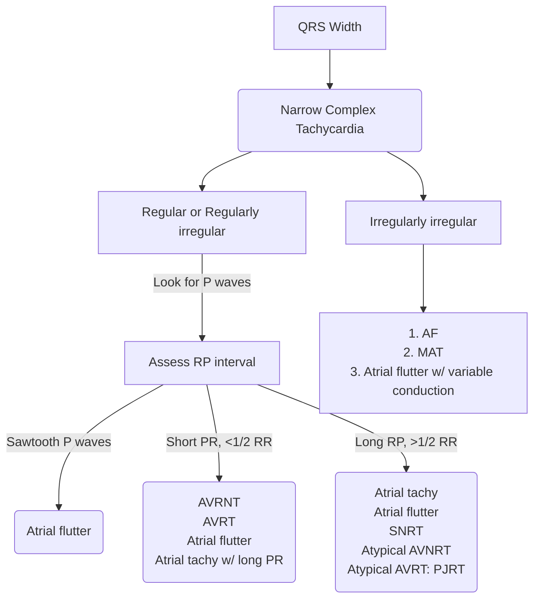

---
tags:
  - EP
aliases:
  - SVT
---

> [!NOTE] Narrow QRS Complex tachycardias
> Narrow QRS complex tachycardias are fast cardiac rhythms (generally more than 100 bpm) with a QRS duration of 100 ms or less.

- SVT is a "grab bag" of [[Tachyarrhythmias|tachyarrythmias]] originating "above the ventricle"
	- [[Sinus Tachycardia]]
	- [[Supraventricular Tachycardia (SVT)]]
		- Ectopic [[Atrial Tachycardia]] (vs. [[Multifocal Atrial Tachycardia]])
		- [[AV Nodal Reentrant Tachycardia (AVNRT)]]
		- [[AV Reentrant Tachycardia (AVRT)]]
	- [[Atrial Fibrillation (AFib)]]
	- [[Atrial Flutter]]

- The most common mechanism that underlies *narrow QRS complex* tachycardias (excluding sinus tachycardia) is **reentry**
	- Other mechanisms of tachycardia include "triggered activity" and "automaticity."
	- The most common causes of SVT are [[Tachyarrhythmias#Enhanced normal automaticity|abnormal automaticity]] or [[Tachyarrhythmias#Re-entry|re-entry]].
- Starts with an A, ends with a V
- Intracardiac tracings show the normal intervals
	- initiation of atrial depolarization **A**
	- His bundle activation **H**
	- Ventricular depolarization **V**
	- **AH** + **HV** = **PR** interval
	- ![[Supraventricular Tachycardia (SVT)-20241223150251158.webp|337]]
- Most common is [[Atrial Fibrillation (AFib)]]
- Paroxysmal supraventricular tachycardias (PSVT) includes:
	- [[AV Nodal Reentrant Tachycardia (AVNRT)]] (65%)
	- AV reentry tachycardia (AVRT), aka ORT (Orthodromic re-entrant tachycardia) (35%)
		- WPW
		- AV reentry over concealed bypass tract
	- [[Atrial Tachycardia]] (5%)
	- **Adenosine** is effective for [[AV Nodal Reentrant Tachycardia (AVNRT)|AVNRT]] and [[AV Reentrant Tachycardia (AVRT)|AVRT, aka ORT]]
		- Not effective in patients with [[Atrial Tachycardia]]
- Short R-P tachycardia
	- [[AV Nodal Reentrant Tachycardia (AVNRT)|AVNRT]] - virtually absent p waves, regular R-R interval
	- Orthodromic Reciprocating Tachycardia (ORT) - retrograde p waves in terminal portion of QRS, regular R-R interval
- Long R-P tachycardia
	- ORT - retrograde p waves in T wave, regular R-R interval
	- A Tach - atypical p wave axis, up to 30% variability in R-R interval ("wobble" can appear a touch irregular)

> [!tip] DDx of Regular Narrow Complex Tachycardias
> Best deduced by first assessing the relationship of atrial activity (P waves) to the QRS complex. P waves with a morphologic appearance identical to that of the sinus P waves are probably due to tachycardias initiated in (or near) the sinus node, regardless of mechanism.

# Regular

- Sinus Tachycardia
- [[Atrial Flutter]]
- [[Atrial Tachycardia]]
- [[AV Nodal Reentrant Tachycardia (AVNRT)]]
- Junctional Tachycardia
	- Permanent Junctional Reciprocating Tachycardia
	- Nonparoxysmal Junctional Tachycardia
- Sinus Nodal Reentrant Tachycardia
- [[AV Reentrant Tachycardia (AVRT)]]

![[Supraventricular Tachycardia (SVT)-20241223152259702.webp]]

| Short RP (RP < PR)                                                                                                               | Long RP (RP > PR) |
| -------------------------------------------------------------------------------------------------------------------------------- | ----------------- |
| [[AV Nodal Reentrant Tachycardia (AVNRT)\|AVNRT]] [[AV Reentrant Tachycardia (AVRT)]] Nonparoxysmal junctional tachycardia |    Sinus Tachycardia Sinus nodal reentrant tachycardia (SNRT) [[Atrial Tachycardia]] Permanent Junctional Reciprocating Tachycardia Nonparoxysmal Junctional Tachycardia Atypical [[AV Nodal Reentrant Tachycardia (AVNRT)]] Atypical AV reentrant tachycardia               |

P wave that is morphologically similar to sinus P waves → tachycardia is initiated in (or near) the sinus node. 3 general situations are possible:
1. atrial activity precedes QRS complex w/ a *normal* delay
	1. In such cases, the RP intervals are longer than the PR intervals, and the tachycardia is designated a "**long RP tachycardia**"
2. P waves occur simultaneously with or shortly after the QRS complex (i.e., in the ST segment or T wave) and thus yield a "**short RP tachycardia**"
3. no relationship may exist between atrial activity and the QRS complex
	1. **AV dissociation**

# Irregular

- [[Atrial Fibrillation (AFib)]]
- [[Multifocal Atrial Tachycardia]]
- [[Atrial Flutter]] with variable conduction
# ECG Clues

- [[Atrial Fibrillation (AFib)]], [[Atrial Flutter]]
- In the majority of [[AV Nodal Reentrant Tachycardia (AVNRT)|AVNRT]], the retrograde P waves occur during the QRS complex and are ∴ invisible on the 12-lead ECG.
- Other flavors of PAT - Bypass tract-mediated macro-re-entry (e.g., AVRT, WPW), Intra-atrial re-entry, and SA nodal re-entry - will have P waves *usually* identifiable on 12-lead ECG on careful inspection.
- Bypass tract-mediated macro-re-entry (e.g., [[AV Reentrant Tachycardia (AVRT)|orthodromic AVRT]], [[Wolff Parkinson White|WPW]]): P waves are generated retrograde → tend to be negative in the *inferior* leads and have RP interval < PR interval ("short RP tachycardia").
	- 📝 because the RP interval is short, the retrograde P wave is often mistaken for a bump on the T wave by the unwary observer.
	- ![[Supraventricular Tachycardia (SVT)-20241223150322185.webp]]

# Response to [[Adenosine]]

![[Supraventricular Tachycardia (SVT)-20241223150346794.webp|450]]

# [[Tachyarrhythmias#Enhanced normal automaticity|Automatic]] SVT

![[Supraventricular Tachycardia (SVT)-20241223150451649.webp]]
- Relatively uncommon, except in the acutely ill patient.
	- There will be an obvious metabolic disturbance, e.g. MI, acute COPD exacerbation, acute alcohol ingestion, and electrolyte disturbances.
- Rule out [[Digoxin|digoxin]] toxicity
- If the ventricular response is rapid enough to produce hemodynamic instability →
	- Pharmacotherapy 💊: the ventricular rate can usually be slowed with [[Digoxin|digoxin]] (if toxicity ruled out), [[Beta-blockers]], or [[Calcium Channel Blockers (CCBs)|CCBs]].
	- Consider [[Electrophysiology (EP) Emergencies#Overdrive Pacing|overdrive pacing]] in the appropriate setting

## Automatic [[Atrial Tachycardia]]

See [[Atrial Tachycardia#Tachyarrhythmias Enhanced normal automaticity Automatic Atrial Tachycardia|Automatic Atrial Tachycardia]]

# [[Tachyarrhythmias#Re-entry|Re-entrant]] SVT

![[Tachyarrhythmias-20241223150819425.webp|337]]
A core assumption here is that pathway A conducts slower, and has a shorter refractory period. Pathway B conducts faster, but has a longer refractory period. Recall, Dr. Gupta's boat-and-wake analogy from [[AV Nodal Reentrant Tachycardia (AVNRT)]] where the fast boat creates a long wake (long refractory period) and the slow boat has a short wake. A signal that originates at the top of the diagram (above the branch) may conduct through both pathways. The signal conducted through A may conduct into B (e.g. if B is blocked → not in refractory period), which then continues conducting all the way through A again, creating a perpetual loop.

- Vast majority of *ambulatory* patients with SVT are d/t [[Tachyarrhythmias#Re-entry|re-entry]], i.e. patients who are not necessarily acutely ill.
- In contrast to re-entrant [[Ventricular Tachycardia (VT)|ventricular tachyarrhtymias]], re-entrant SVT is usually seen in pts w/o chronic heart disease. Instead for re-entrant SVT the re-entrant substrate is often congenital. ∴ the typical patient is young and healthy.
- 5 general categories:
	- [[AV Nodal Reentrant Tachycardia (AVNRT)|AV nodal re-entry]] (60% of PAT)
	- Bypass tract-mediated macro-re-entry (30% of PAT)
		- Examples: [[AV Reentrant Tachycardia (AVRT)]], [[Wolff Parkinson White|WPW]]
	- Intra-atrial re-entry
	- SA nodal re-entry
	- [[Atrial Flutter]]/[[Atrial Fibrillation (AFib)]]
	- 📝 the first four are sometimes lumped together into one large group as '[[Paroxysmal Tachycardia#Paroxysmal Atrial Tachycardia|Paroxysmal Atrial Tachycardia]]'
- **Bypass tract-mediated macro-re-entrant tachycardia** is a "macro-re-entrant" circuit because it involves the AV node, His-Purkinje system, the ventricular and atrial myocardia, and the bypass tract, i.e. the circuit consists of several types of cardiac tissue.
	- ![[Supraventricular Tachycardia (SVT)-20241223152409985.webp|209]]
	- If they conduct in the antegrade direction, the patient is said to have [[Wolff Parkinson White|Wolff-Parkinson-White syndrome]] and the surface ECG will show pre-excitation of the QRS complex.
	- Unlike [[AV Nodal Reentrant Tachycardia (AVNRT)|AVNRT]] where the atria and ventricles depolarize nearly simultaneously, in macro-re-entry the atria and ventricles depolarize sequentially → distinct P waves are virtually _always_ seen.
		- **short-RP tachycardia**, i.e. RP interval shorter than the PR interval, because of retrograde conduction via the bypass tract tends to be _faster_ than antegrade conduction via the normal AV conducting system.
		- P waves often negative in the inferior leads b/c atrial stimulation is in retrograde direction (P wave axis is superior/going upward)
	- **Treatment**:
		- [[Beta Blockers|BBs]], [[Calcium Channel Blockers (CCBs)|CCBs]], [[Digoxin|digoxin]] +/- [[Anti-Arrhythmic Drugs#Class Ia|Class Ia drugs]]
		- ↑ refractory period of the AV node: [[Beta Blockers|BBs]], [[Calcium Channel Blockers (CCBs)|CCBs]], [[Digoxin|digoxin]]
			- decreases the width of the tachycardia zone
		- ↑ AV nodal block (→ induces [[AV Block#Mobitz Type 1 (aka Wenckebach)|Wenckebach]] when tachycardia begins)
			- a single blocked beat will immediately terminate the tachycardia
		- ↑ retrograde refractory period of the bypass tract with [[Anti-Arrhythmic Drugs#Class Ia|Class Ia drugs]]
			- Downside: [[Anti-Arrhythmic Drugs#Class Ia|Class Ia drugs]] also ↑ the antegrade RP of the bypass tract → effectively ↑ the tachycardia zone. ∴ only use 'em when trying to achieve "pharmacologic ablation"
		- [[Anti-tachycardia Pacing (ATP)]]: termination by programmed pacing
		- **Ablation** is highly effective
- **Intra-atrial reentry** occurs when the reentrant circuit is completely within the atria, and does not include the AV node at all. This type of reentrant circuit generates P waves that look different from the standard sinus P wave. (Source)
- **SA nodal re-entry**, like the name implies, is contained within the SA Node. This type of reentry is interesting in that it is spontaneously occurring, and [[Atrial Fibrillation (AFib)]] does not exhibit the warm-up behavior that is usually observed with normal [[Sinus Tachycardia|sinus tachycardia]]. The P waves it produces are identical to normal sinus P waves.
